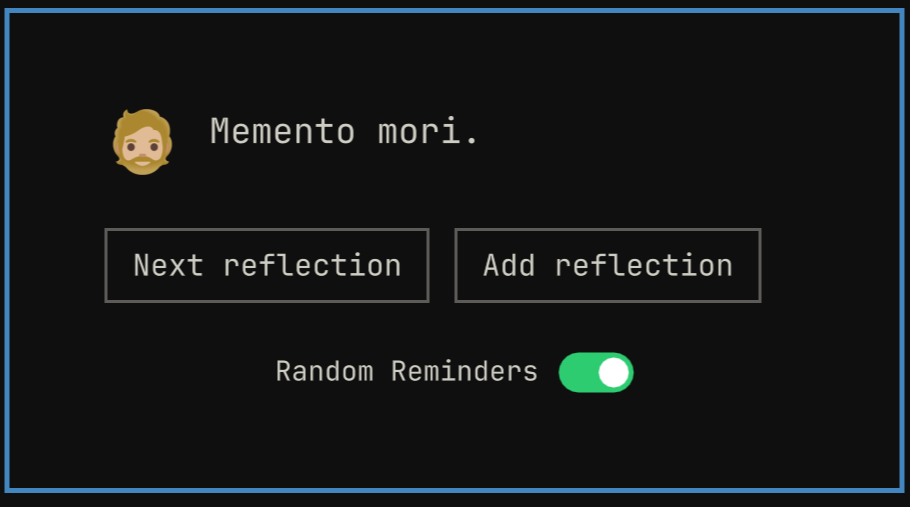

# Respice

**Pronunciation:** RES-pi-keh (Classical Latin /ˈres.pi.kɛ/)

A stoic companion plugin for [Omarchy](https://omarchy.org) — memento mori
reminders and stoic reflections, right in the bar.

*Respice* (Latin: "look back/behind") — from the reminder Roman generals
were said to have whispered to themselves in triumph: memento mori, respice
post te, hominem te esse memento. "Remember, you are only a man."



## What it does

A 🏛️ icon sits in the bar (currently pinned to the right section). Clicking
it drops a panel directly beneath the icon, where 🧔🏼 — your philosopher
mentor — delivers:

- The current stoic quote.
- **Next reflection** — cycles to the next quote.
- **Add reflection** — opens a text field to write your own (30-word limit,
  enforced as you type). Press Enter or click **Save** to add it to the
  rotation; Escape or **Cancel** discards it.

The full rotation — the 4 built-in quotes plus anything you've added —
lives in `~/.local/state/omarchy/respice/reflections.json`, a plain JSON
array of strings. It's created the first time the plugin runs, seeded with
the defaults, and from then on the file *is* the rotation: hand-edit it to
reword a quote, reorder them, or delete any entry — including the
defaults, if a particular one isn't for you. Changes are picked up live,
no need to reopen the panel or restart the shell. Delete the whole file to
reset back to the 4 defaults.

On top of that, Respice periodically pushes one of the quotes as a desktop
notification — a nod to the servant Roman generals were said to have kept
at their side to keep whispering "memento mori" during a triumph. It picks
a random gap (1–5 hours) between reminders, all day, with no
active-hours restriction yet (planned for a future settings UI update). A
**Random Reminders** toggle in the panel turns these off entirely; the setting is
persisted and survives a shell restart. Switching it back on fires an
immediate preview notification (your first reflection) so you know what
to expect.

## Installation

```bash
omarchy plugin add https://github.com/EdGracia/respice.git --enable
```

This clones the plugin into
`~/.config/omarchy/plugins/io.github.edgracia.respice`, validates it, and
(with `--enable`) turns it on and asks which bar section to place it in.
If the icon doesn't show up right away:

```bash
omarchy restart shell
```

## Uninstallation

```bash
omarchy plugin remove io.github.edgracia.respice
```

This disables the widget and deletes its plugin folder. Your saved
reflections and the Random Reminders setting
(`~/.local/state/omarchy/respice/reflections.json` and
`~/.local/state/omarchy/respice/settings.json`) are left on disk — delete
those by hand if you want a clean slate.

## Dependencies

None beyond Omarchy itself. The reminder notification is sent via
`omarchy-notification-send`, a command that ships with Omarchy — no
external packages or services required.

## Project layout

- `manifest.json` — plugin metadata (id `io.github.edgracia.respice`, kind `bar-widget`).
- `BarWidget.qml` — the bar icon and click-to-toggle wiring; also the
  owner of the shared quote list/index and the random-interval reminder
  timer, since it (unlike the panel) is never torn down.
- `Panel.qml` — the popup: the "Add reflection" editor and all the UI,
  reading/mutating quote state on `BarWidget.qml` via `hostWidget`.
- `~/.local/state/omarchy/respice/reflections.json` — the full reflection
  rotation, defaults included (not part of this repo; created on first
  run). A plain JSON array of strings — hand-edit, reorder, or delete any
  entry, including the defaults, if you'd rather manage it outside the
  panel.
- `~/.local/state/omarchy/respice/settings.json` — stores the Random Reminders
  toggle (`{ "reminderEnabled": true }`), created the first time it's
  flipped in the panel.


Useful commands while iterating:

```bash
omarchy bar move io.github.edgracia.respice --section right   # bar placement
omarchy-shell shell rescanPlugins          # force a reload if a change doesn't apply
```

## License

MIT
